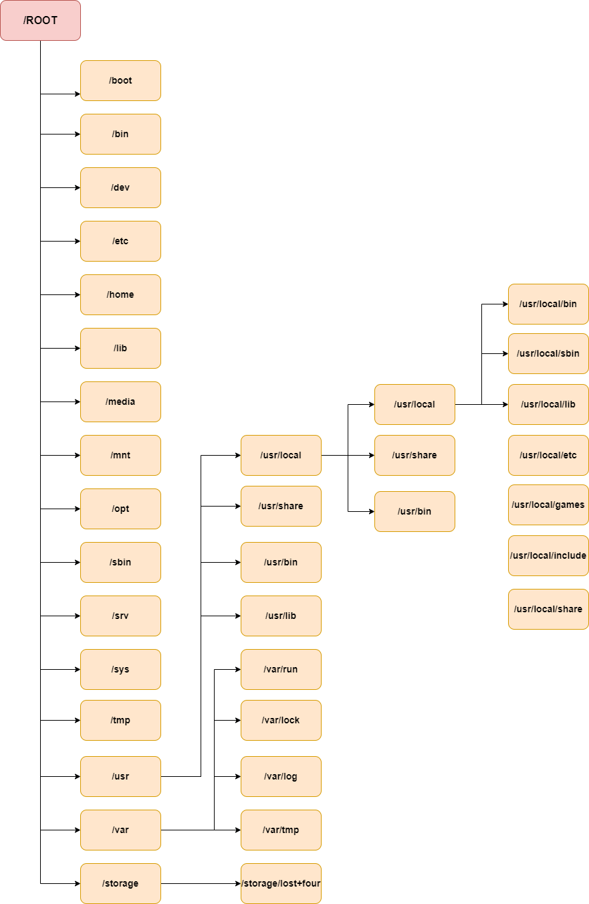

    Nama		        : Rakha Putra Pratama
    NRP		        : 3122600005
    Kelas		        : 2 D4 IT A
    Mata Kuliah	        : Workshop Administrasi Jaringan
    Dosen Pengampu	        : Dr. Ferry Astika Saputra S.T., M.Sc

# TUGAS 2.1 Linux Directory Structure

## Directory Tree

<div align="center">
   
   <p><strong>Gambar 1:</strong>Linux Directory Structure</p>
</div>

</br>

```bash
/
├── boot
├── bin
├── dev
├── etc
├── home
├── lib
├── media
├── mnt
├── opt
├── sbin
├── srv
├── sys
├── tmp
├── usr
│   ├── local
│   │   ├── bin
│   │   ├── etc
│   │   ├── games
│   │   ├── include
│   │   ├── lib
│   │   ├── sbin
│   │   └── share
│   ├── share
│   ├── sbin
│   └── bin
│       └── lib
└── varx`
    ├── backups
    ├── cache
    ├── lib
    ├── lock
    ├── log
    ├── opt
    ├── run
    ├── spool
    └── tmp
└── storage
    └── lost+found
```
<p align="center"><strong>Gambar 2:</strong>Directory Tree</p>

## Penjelasan Directory

## Struktur Direktori dalam Sistem Linux

- **/root**: Direktori utama untuk keseluruhan struktur direktori.

### Direktori Boot
- **/boot**: Berisi file-file yang diperlukan untuk booting sistem, termasuk bootloader (seperti Grub atau Lilo), kernel, initrd, dan file konfigurasi system.map.

### Direktori Sys
- **/sys**: Berisi file-file terkait kernel, firmware, dan sistem.

### Direktori Sbin
- **/sbin**: Berisi binary sistem penting dan alat administrasi sistem yang diperlukan untuk operasi dan kinerja sistem.

### Direktori Bin
- **/bin**: Berisi binary penting untuk pengguna dan utilitas yang diperlukan dalam mode pengguna tunggal. Contohnya, termasuk cat, ls, cp, dll.

### Direktori Lib
- **/lib**: Berisi file library untuk semua binary yang terdapat di direktori /sbin & /bin.

### Direktori Dev
- **/dev**: Berisi file dan driver sistem penting.

### Direktori Etc
- **/etc**: Berisi file konfigurasi sistem penting, termasuk /etc/hosts, /etc/resolv.conf, nsswitch.conf, defaults, dan file konfigurasi jaringan. Sebagian besar ini adalah file konfigurasi sistem dan aplikasi khusus host.

### Direktori Home
- **/home**: Semua direktori home pengguna berada di bawah direktori ini, kecuali direktori home root yang disimpan di bawah direktori /root. Direktori ini menyimpan file pengguna, pengaturan pribadi seperti .profile, dll.

### Direktori Media
- **/media**: Titik mount generik untuk media yang dapat dilepas seperti CD-ROM, USB, Floppy, dll.

### Direktori Mnt
- **/mnt**: Titik mount generik untuk sistem file sementara. Ini berguna terutama saat memecahkan masalah dari CDROM, di mana Anda mungkin perlu memasang sistem file Root dan mengedit konfigurasi.

### Direktori Opt
- **/opt**: Direktori yang jarang digunakan di Linux untuk Paket Perangkat Lunak Opsional. Ini digunakan secara ekstensif dalam OS UNIX seperti Sun Solaris tempat paket perangkat lunak diinstal.

### Direktori Usr
- **/usr**: Sub hierarki ke sistem file root yang merupakan direktori data Pengguna. Berisi utilitas dan aplikasi khusus pengguna.

    - **/usr/sbin**: Berisi binary sistem non-esensial non-kritis dan utilitas jaringan.
    - **/usr/bin**: Berisi binary perintah non-esensial non-kritis untuk pengguna.
    - **/usr/lib**: File library untuk binary di direktori /usr/bin & /usr/sbin.
    - **/usr/share**: Direktori data bersama yang independen platform.
    - **/usr/local**: Sub hierarki di bawah direktori /usr yang memiliki data khusus Sistem Lokal termasuk binary pengguna dan sistem serta library mereka.

### Direktori Var
- **/var**: Direktori /var sebagian besar dipasang sebagai sistem file terpisah di bawah root tempat semua konten variabel seperti log, file spool untuk printer, crontab, pekerjaan at, mail, proses yang sedang berjalan, file lock, dll.

### Direktori Tmp
- **/tmp**: Sistem file sementara yang menyimpan file sementara yang dihapus saat sistem reboot.

### Direktori Virtual
- **/storage**: Menyimpan data, seperti file dan database.
    - **/storage/lost+found**: Berguna sebagai menyimpan file yang terjadi kegagalan pada saat proses.
